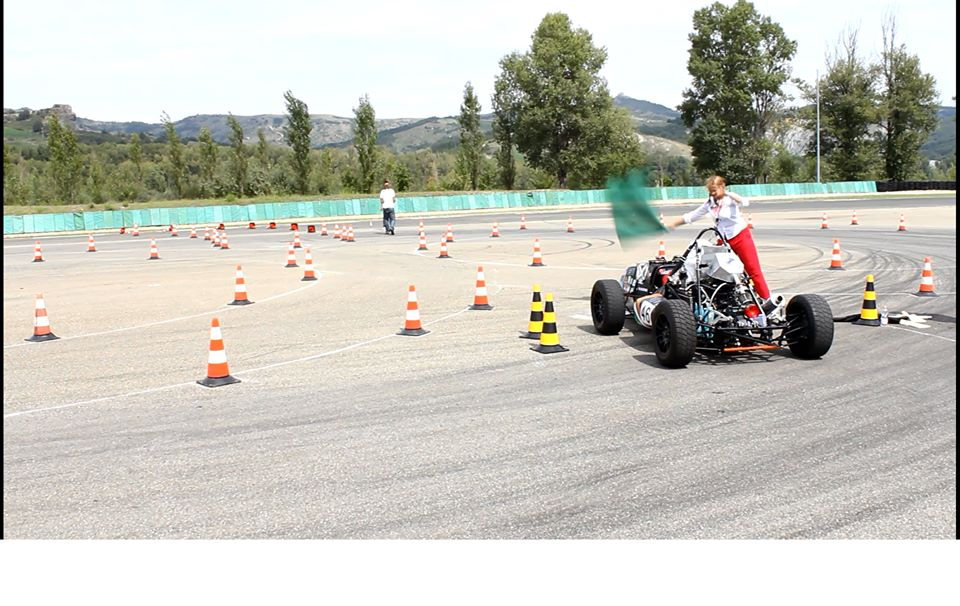
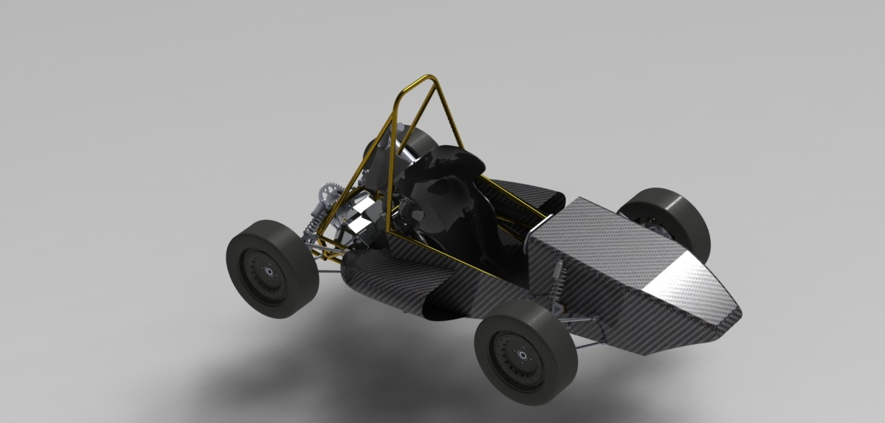
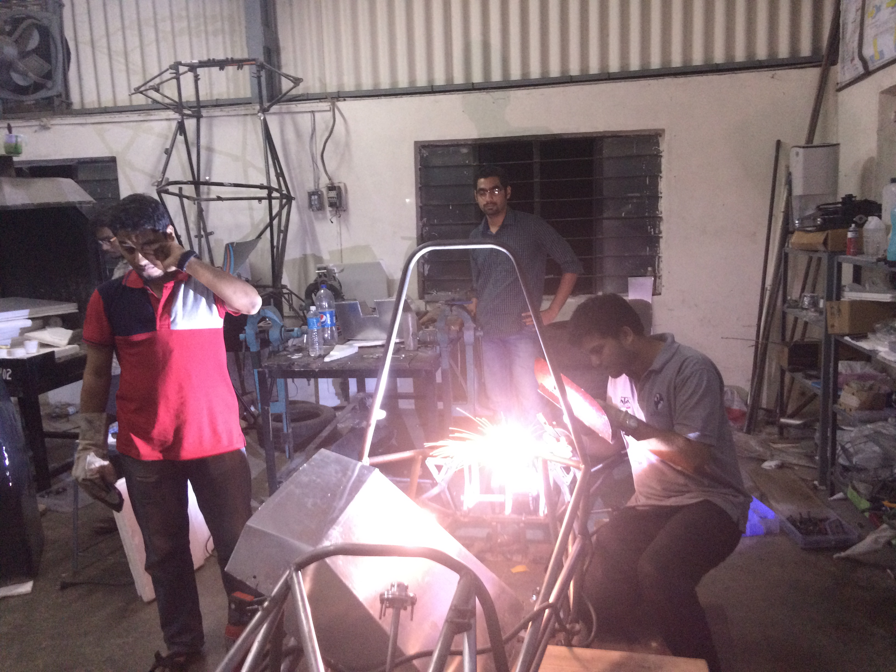

1) Initiated the use of light-weight carbon-fiber composites 
2) Designed and built the steering system and steering kinematics from ground up using tire data  
3) Designed and built the vehicles braking system  
4) Built the Chassis wire frame CAD  
5) Did the final vehicle assembly in CAD by mediating with various team departments 

Our team won the first prize in the Cost Event, Formula Student Italy, 2015. We are the first Indian team to win the first place at an international Formula student event.

 
 

