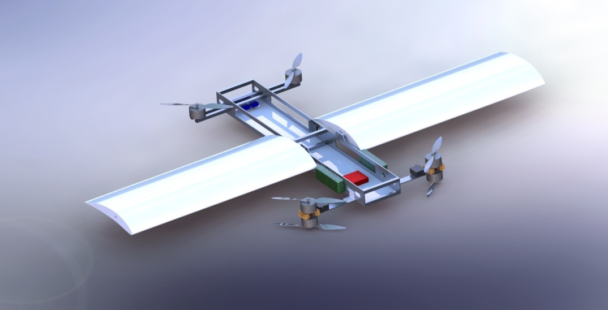
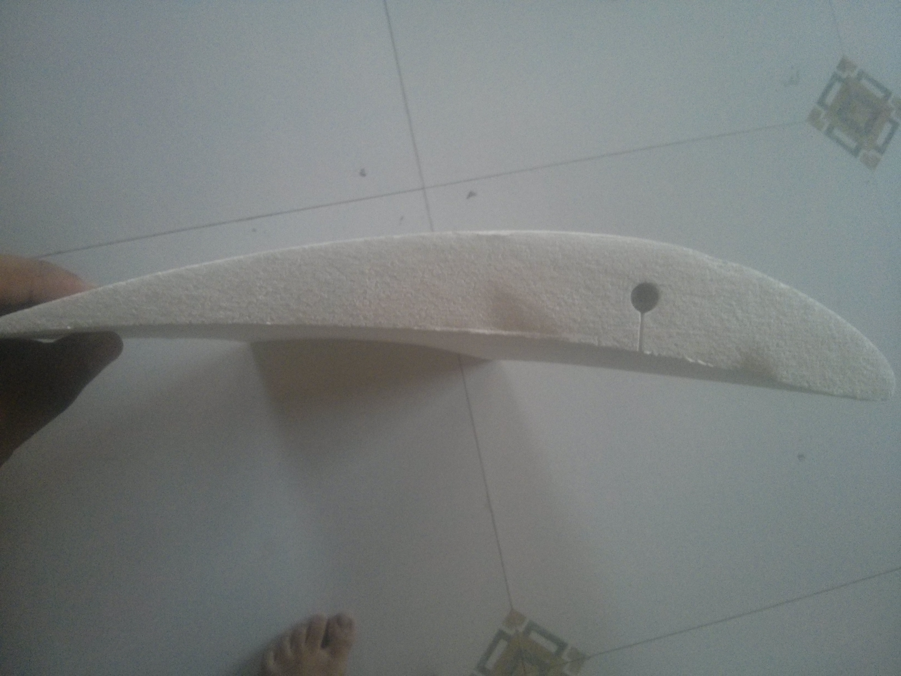
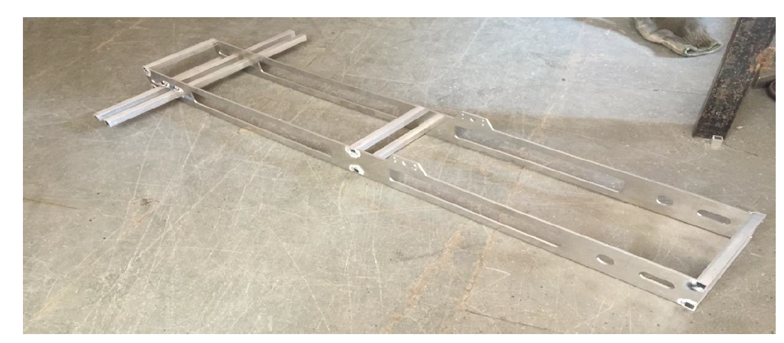

 
 

A fixed rotor drone can be stabilized very well in a given area, something that isn't possible with a conventional winged aircraft. Fixed wings drones, however, are inefficient over long distances. This problem can be tackled by a tilt-rotor aircraft combining the best of both these types. I attempted to build and stabilize a tilt-rotor drone for my undergraduate capstone project. Though the tilt-rotor did not work I concluded by building a fixed rotor quadcopter, and gained decent knowledge in the whole process




