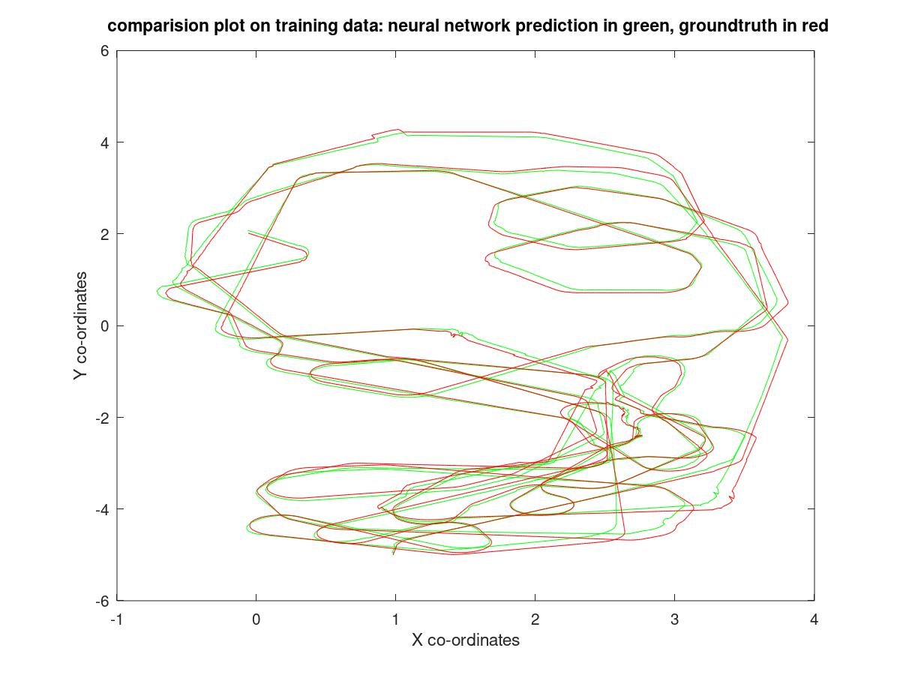
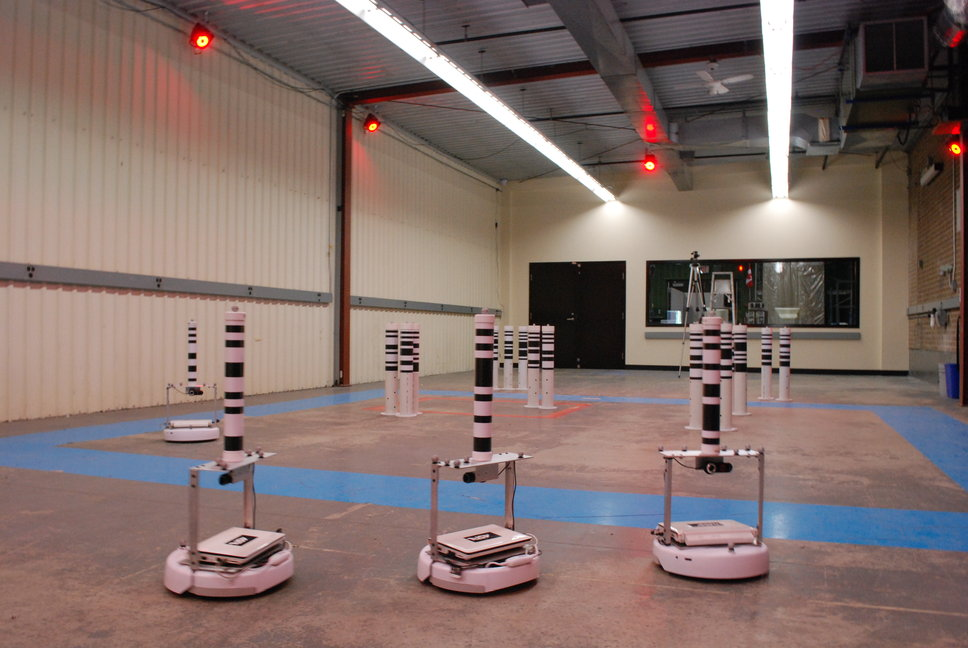

A shallow neural network was trained using the UTIAS Multi-Robot Cooperative Localization and Mapping Dataset, by the ASRL lab.The network managed to learn the model and could predict the posterior position given a control command. This trajectory matched well to the ground-truth.

 

<a href= "https://github.com/vishwajeet-NU/ML-AI-/tree/master/neural_network"> ​code source </a>

robot image source : ASR Lab. Uni Toronto

​
