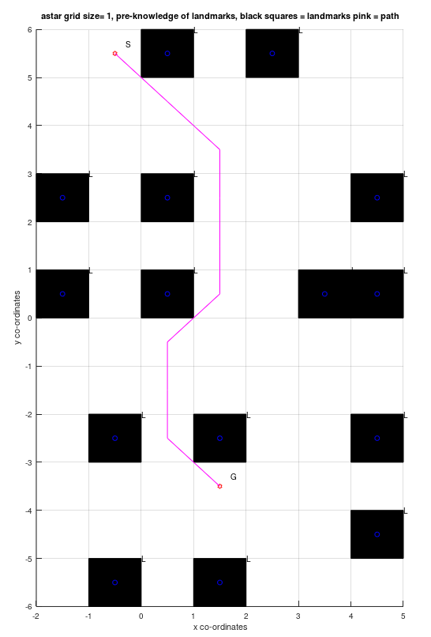

Two variants of A* are implemented in a grid based world with obstacles. Data was used from the UTIAS Multi-Robot Cooperative Localization and Mapping Dataset, by the ASRL lab.  
​

1) Offline A*: Paths are planned given a start position and a goal. A robot then follows this path using a simple P-controller. This however assumes the robot will follow the path as is, which is never the case given a noisy real-world.  

2) Online A*: Paths are recalculated for each achieved position. Gaussian noise is added to the motion model to simulate motion uncertainty.

code source:  

https://github.com/vishwajeet-NU/ML-AI-/tree/master/a_star
