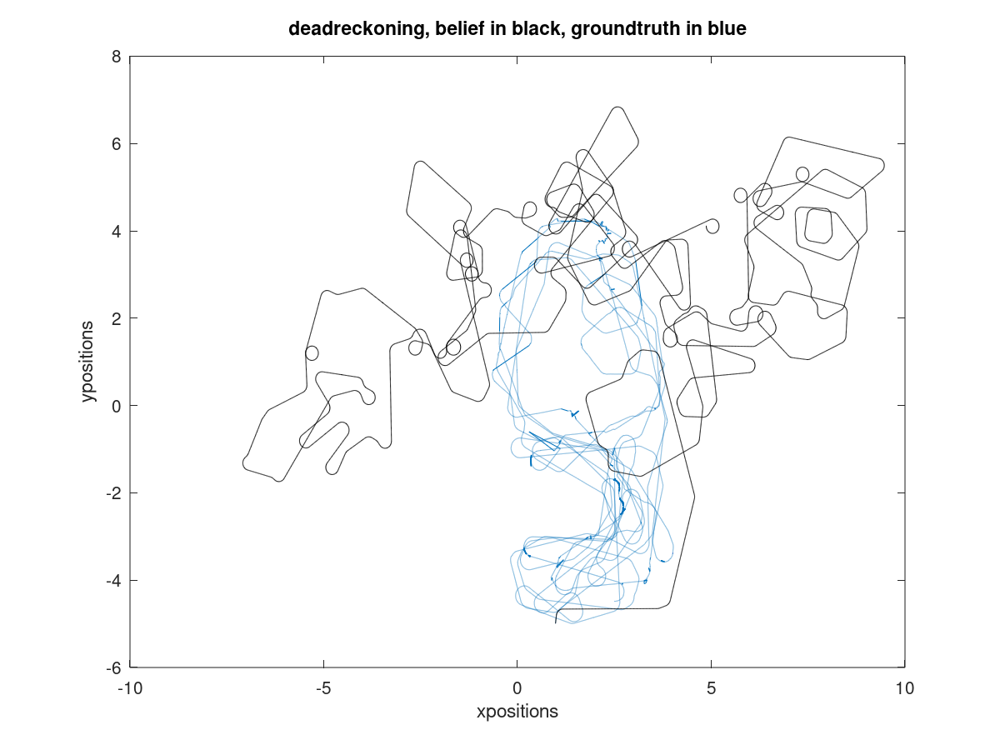
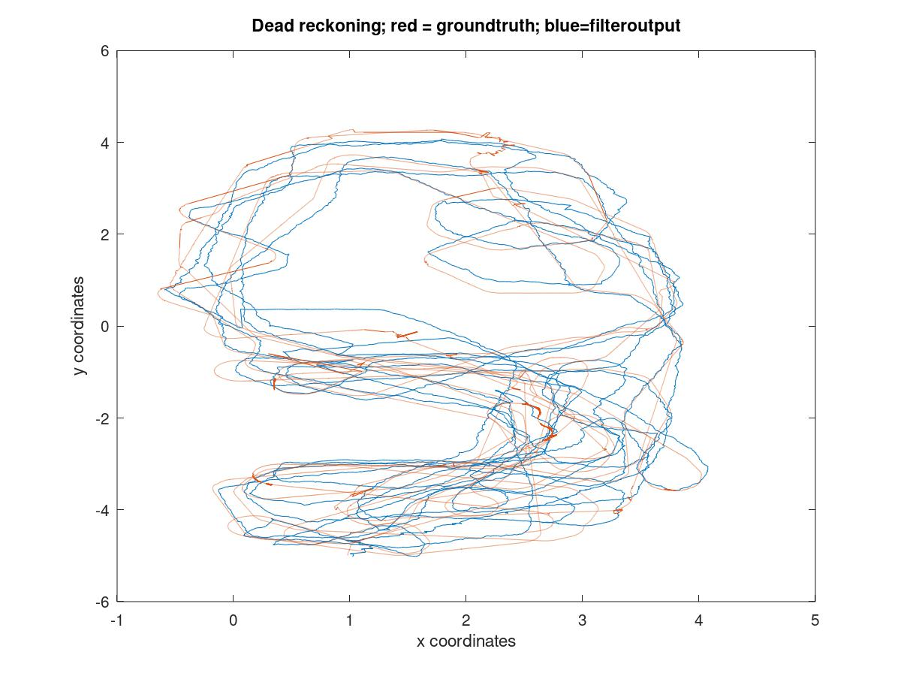

 

State estimation is an important tool to localize a dynamical system in space. Particle filter is a non-parametric filter that can be used for the same. This algorithm is used to a high degree of success, for the UTIAS Multi-Robot Cooperative Localization and Mapping Dataset, by the ASRL lab.
​
 

<a href= "https://github.com/vishwajeet-NU/ML-AI-/tree/master/particle_filter"> ​code source </a>

