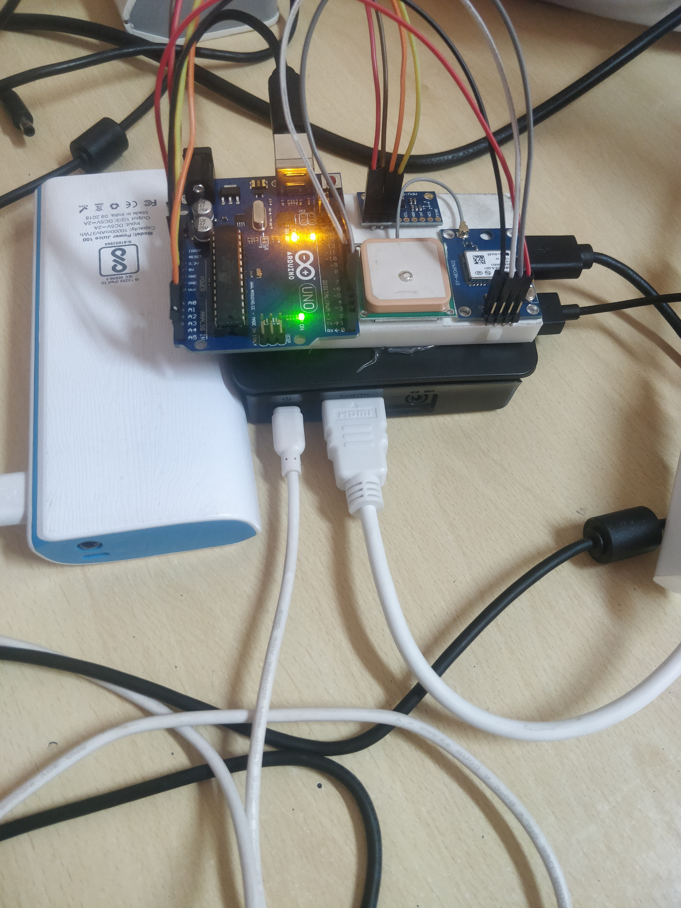
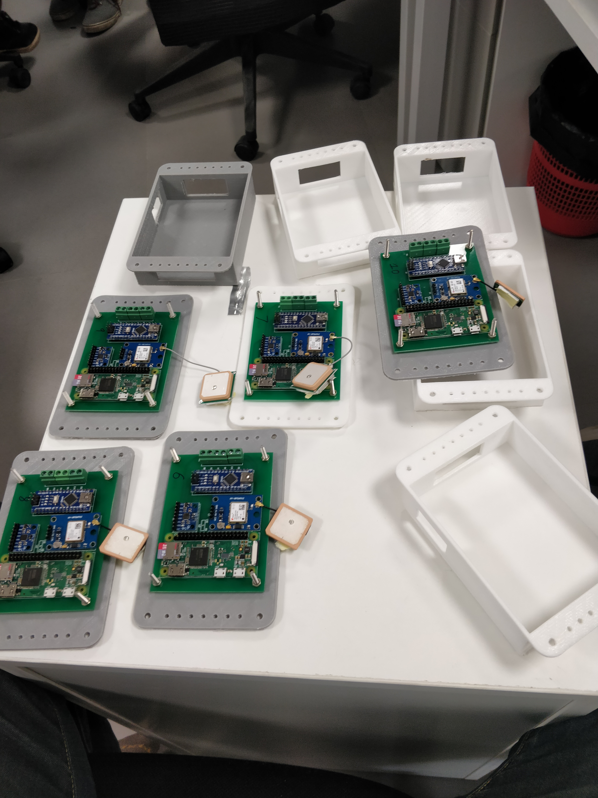

 
 

Built and designed the whole pipeline from 3d printing and assembly on the scooters, pcb design, and electronic component selection, to software development. The system uploaded data from 5 onboard sensors to a MySQL database hosted on the cloud.

